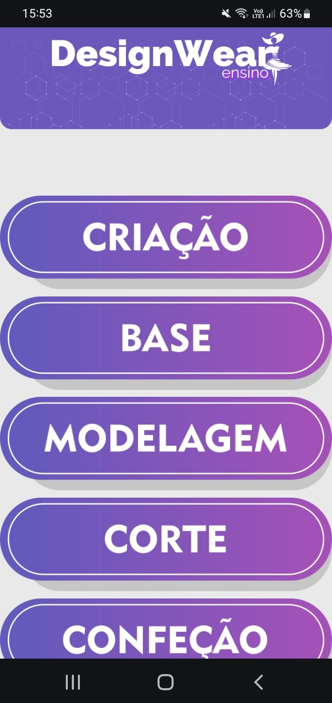

# DesignWear

 
Uma breve descrição sobre o que esse projeto faz e para quem ele é

## Referência

 - [A-frame Docs](https://aframe.io/)
 - [Mind-AR Docs](https://hiukim.github.io/mind-ar-js-doc/)

## Autores

- [Lucas Guerega](https://github.com/LucasGuerega)
- [Leonardo Leiria Fernandes](http://lattes.cnpq.br/1391060022581204)

## Funcionalidades

- [Site do DesignWear](https://designwear.netlify.app/)

## Screenshots
 
Tela principal

 
Tela 

## Usado por

Esse projeto é usado pelas seguintes :

- 

